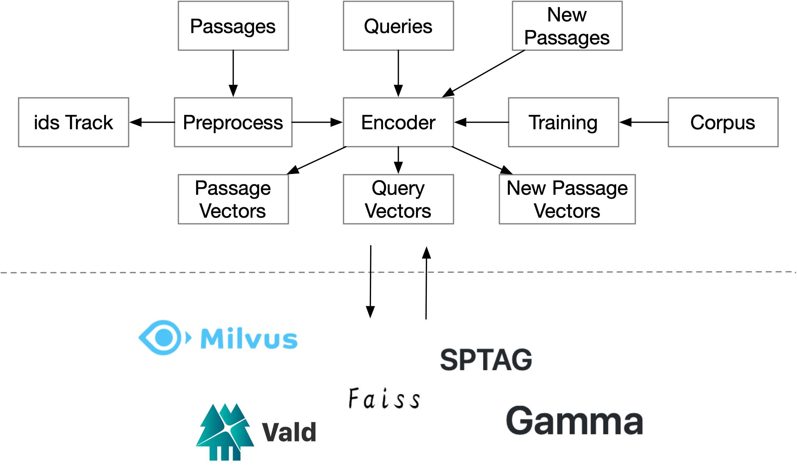

# Dense Vector Search



#### Step 1: Process corpus

We use doc-QA dataset as training corpus. Please proces original data to following format:

```shell
[
	{"dataset": "",
	 "question": "",
	 "hard_negative_ctxs": [
	 	{"title": "",
	 	 "score": "",
	 	 "title_score": "",
	 	 "passage_id": "",
	 	 "text": ""},
	 	 ...
	 ],
	 "negative_ctxs": [
	 	{"title": "",
	 	 "score": "",
	 	 "title_score": "",
	 	 "passage_id": "",
	 	 "text": ""},
	 	 ...
	 ],
	 "positive_ctxs": 
	 	{"title": "",
	 	 "score": "",
	 	 "title_score": "",
	 	 "passage_id": "",
	 	 "text": ""},
	 	 ...
	 ]},
	 ...
]
```


#### Step 2: Training encoder

Here we use method proposed by Facebook Research ([here](https://arxiv.org/abs/2004.04906)). Run the following script:

```shell
python -m torch.distributed.launch \
	--nproc_per_node=8 train_dense_encoder.py \
	--max_grad_norm 2.0 \
	--encoder_model_type hf_bert \
	--pretrained_model_cfg ../cn_bert \
	--seed 12345 \
	--sequence_length 256 \
	--warmup_steps 1237 \
	--batch_size 4 \
	--do_lower_case \
	--train_file ../train.json \  
	--dev_file ../dev.json\   
	--output_dir save_path \
	--learning_rate 2e-05 \
	--num_train_epochs 40 \
	--dev_batch_size 4 \
	--val_av_rank_start_epoch 30 \
	--hard_negatives 4
```

#### Step 3: Encode passages

Use the trained encoder to encode passages into dense vector, run the following script:

```shell
python generate_dense_embeddings.py \
	--model_file ../model_path \
	--ctx_file ../passage_file \
	--shard_id 0 --num_shards 1 \
	--batch_size 2048 \
	--out_file ../save_path 	
```

#### Step 4: Build index

The encoded vector can be used for any type of vector search framework. Here we use [Faiss](https://github.com/facebookresearch/faiss). Run the following script to get index file:

```shell
python faiss_dump.py  \
    --encoded_ctx_file ../encoded_file \
    --save_path ../save_path
```

#### Step 5: Start servers

Encoder server:

```shell
python app_encoder.py \
	--model_file model_path \
	--port 4609 \
  #--no_cuda \
	#--local_rank -1
```

Search server:

```shell
python app_faiss.py \
	--save_path ../t \
    --gpu \
    --encoder_url 0.0.0.0:4609 \
    --port 4889

```


Search server has a built-in update api which can be called by post request to:

```shell
http://0.0.0.0:4889/update/
```
use
```shell
{
	"batch":[
      ["content","id"]
      ], 
      "dump": "" 
		}
```

Where "dump" is a flag to save updated index.